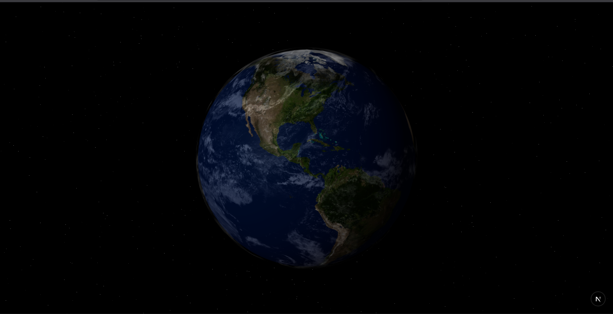

# 3D Earth Web App

This project is a simple 3D interactive Earth built with **Next.js**, **React Three Fiber**, and **Three.js**.  
It displays a realistic rotating Earth with day, night, and cloud textures.

---

## How to Run

1. Clone the repository:
   ```bash
   git clone https://github.com/your-username/your-repo-name.git
   cd your-repo-name

## Preview: 

